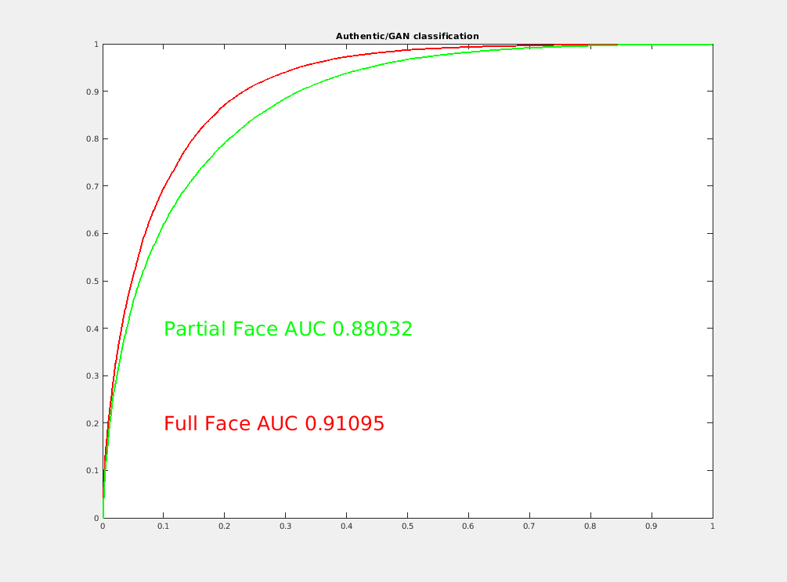

## GAN-Scanner, a GAN Image Detector 

This page describes a GAN image detector developed at Computer Vision Lab, University of Maryland, College Park.

## Description

This detector employs STyleGAN2 inversion as the core for detection. The hypothesis is that a good inversion of a probe is highly like to be a GAN generated image, while a real-image will be slighly less invertable. Multiple metrics are used to compute a feature vector that reflects the inversion outcome. This feature is then used by a classifer to compute a score (0 to 1.0) where 0 is likely a GAN image image and 1.0 is an authetic image.

The classifier was trained on a balanced dataset of 81400 images, 40800 authentic (FFHQ+CELEBHQ) and 40800 GAN generated (5100 from each of StyleGAN2-raw plus three compressions levels, 10,25,50, StyleGAN-ADA, inversions of (StyleGAN2 and CELEBHQ), StyleGAN2 Distillation and SAM (see references at the bottom).

## Request Code or Data 

Please fill out the [Form](https://docs.google.com/forms/d/e/1FAIpQLSd-q3XZmHlvPxZOP8nwFi8Q8cl4epx8HyWrx5ApOszj8g-wnA/viewform) after reading and agreeing our License Agreement. For any questions or feedback, please e-mail yaser@umd.edu with the subject [Question about the GAN-Scnanner]. Please note that access will granted to image-consuming entities for public interest.Individuals (including students and researchers), re-packagers, as well as opaque entities will not be granted access.

## ROC of the Classifier

The trained classifier is show under two configurations in the graph below. The full face configuration assumes that the face is fully visible with a reasonable background area. The second assumed that the face may be partially obsecured, either due to photo composition or partial occlusioni (for example in a multi-person scene). The performance charactersitics deteriorate sightly. From AUC of 0.91 to 0.88. 
### 

## Open-World Detection Accuracy 

| DATASET  | Type  | Data Size | Detection Accuracy1| Detection Accurcy2 | Notes |
| :------------ |:---------------|:-----|:-----|:-----|:-------|
| [MFC19-20](https://mfc.nist.gov/#pills-overview)  | Real Data | 7.6K | 95.1%|93.3% | Real-world diversity|
| [UMD-BLEND](https://mfc.nist.gov/#pills-overview)  | Real Data | 21K | 93.6%|85.0% | Real-world diversity|
| [FFHQ-Extension](https://mfc.nist.gov/#pills-overview)  | Real Data | 27K | xx%|xx% | Real-world diversity|
| [SAM](https://github.com/yuval-alaluf/SAM) | StyleGAN2 |13.8K        |   98.4%|96.4% |  StyleGAN2-latentspace|
| [NAVIGAN](https://github.com/yandex-research/navigan) | StyleGAN2 | 8.4K | 99.8%|99.2%|StyleGAN2-latentspace|
| [StyleMixing](https://arxiv.org/abs/2003.03581)| StyleGAN2+Pix2pix | 93.4K|42.2%|55.8%| StyleGAN2+Pix2Pix|
| [MobileStyleGAN](https://arxiv.org/abs/2104.04767)| StyleGAN2-reduced| 5K | 42%|37.8% |StyleGAN2-varient|
| [CIPS](https://github.com/saic-mdal/CIPS)|GAN|7K|63.2%|76.5%|Non-CNN, positional Encoding|
| [StyleGAN3](https://nvlabs.github.io/alias-free-gan/)|StyleGAN3|||||

## Take into account:

1. This is Research Code, there is no liability for use or guarantee of performance 
2. A Docker-based deployment (currently tested on linux based systems)
4. This Software requires access to GPU 

## Related Work
1. [NIST Media Forensic Challenge](https://mfc.nist.gov/#pills-overview)
2. [Only a Matter of Style: Age Transformation Using a Style-Based Regression Model, SIGGRAPH 2021](https://github.com/yuval-alaluf/SAM)
3. [Encoding in Style: a StyleGAN Encoder for Image-to-Image Translation, CVPR 2021](https://github.com/eladrich/pixel2style2pixel)
4. [StyleGAN2 Distillation for Feed-forward Image Manipulation,ECCV2020](https://arxiv.org/abs/2003.03581)
5. [MobileStyleGAN: A Lightweight Convolutional Neural Network for High-Fidelity Image Synthesis](https://arxiv.org/abs/2104.04767)
6. [Training Generative Adversarial Networks with Limited Data](https://github.com/NVlabs/stylegan2-ada)
7. [Image Generators with Conditionally-Independent Pixel Synthesis](https://github.com/saic-mdal/CIPS)
8. [Navigating the GAN Parameter Space for Semantic Image Editing, CVPR 2021] (https://github.com/yandex-research/navigan)
9. [Alias-Free Generative Adversarial Networks](https://nvlabs.github.io/alias-free-gan/)

