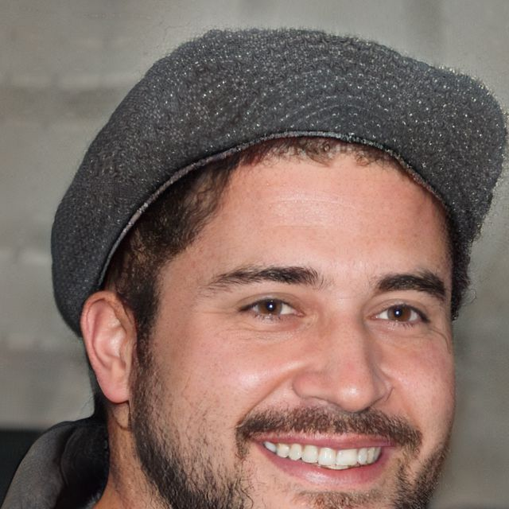
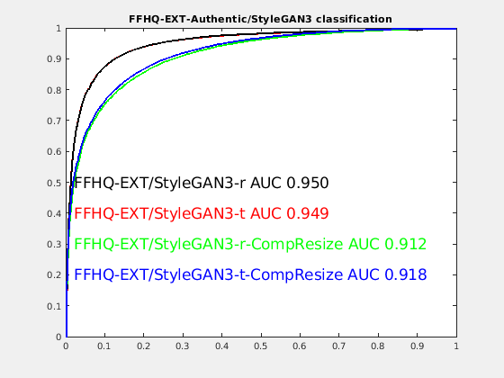

## GAN-Scanner: A Detector for Face of StyleGAN+

 

This page describes a StyleGAN+  face image detector developed by [Yaser Yacoob](http://users.umiacs.umd.edu/~yaser) at Computer Vision Lab, University of Maryland, College Park.
A detailed description will be released in a forthcoming paper.

## Description

This detector is designed for faces. It works best at medium and high resolution images (128x128 and higher).

This detector employs StyleGAN2 inversion as the core-idea for detection. The hypothesis is that a perfect inversion of a face is highly likely to be a GAN generated image, while a real-image is slightly less invertable. Multiple metrics are used to compute a feature vector that reflects the quality of the inversion. The computed feature is then scored (range 0-1.0, where 0 is likely a GAN image image and 1.0 is an authentic image). An evidence image is also provided to help a human make a final determination if the processing is convincing.

The classifier was trained on a balanced dataset of 81400 images, 40800 authentic (FFHQ+CELEBHQ) and 40800 GAN generated (5100 from each of StyleGAN2-raw+three compressions levels, 10,25,50, StyleGAN-ADA (inversions of StyleGAN2 and CELEBHQ), StyleGAN2 Distillation and SAM (see references at the bottom).

## Request Code or Data 

Please fill out the [Form](https://docs.google.com/forms/d/e/1FAIpQLSd-q3XZmHlvPxZOP8nwFi8Q8cl4epx8HyWrx5ApOszj8g-wnA/viewform) if you are interested in the software.  Please note that access will be granted 
to **"image-consuming entities for public interest".** Individuals (including students and researchers), re-packagers, as well as opaque entities will **not**  be granted access. 

For any questions or feedback, please e-mail yaser@umd.edu with the subject [Question about the GAN-Scnanner].

## ROC of the GAN-Scanner Classifier

The trained classifier is shown, in the graph below,  under two configurations. The full face configuration assumes that the face is fully visible with a reasonable background area. The second configuration  assumes that the face may be partially obsecured, either due to photo composition or partial occlusion (for example in a multi-person scene). The performance charactersitics deteriorate sightly. From AUC of 0.91 to 0.88. 

### 

## Open-World Detection Accuracy 
Several targeted experiments were conducted to determine how GAN-Scanner performs in an open-world environment. Three datasets of real images were used, to assess performance under different/unknown data distributions. 
[MFC 19-20](https://mfc.nist.gov/#pills-overview) is a NIST collected dataset for Forenisc Analysis. UMD-BLEND is derived from over 50K images (a) IARPA JANUS-CS3 Face Recogniton dataset,
(b) [FaceBook Fairness Dataset](https://ai.facebook.com/blog/shedding-light-on-fairness-in-ai-with-a-new-data-set),
(c) Boston and Marine Corp Marathons, flicker-based Dataset (UMD), (d) and Women's March in DC Flicker Dataset (UMD). The UMD dataset is the most diverse, and therefore the best reflection of real world dataset at scale. It covers a few decades of camera technology, subject matter, resolution and image composition.
Finally, FFHQ-Extension is a 27K images unreleased FFHQ-sourced from Nvidia's original collection (these were released for this specific detection task).

The GAN generators varied, between  StyleGAN2-related algorithms (these strongly operate in the same latent space), mixed or significant variants of StyleGAN2,  non CNN architectures as well as StyleGAN3.
The following detection accuracy reflects open-world performance of GAN-Scanner. Note that for StyleGAN3 we provide 4 different test results that correspond to two configurations provided by Nvidia, config-r and config-t.
For each we provide a no-compression performance as well as an unknown rescaled and compressed data that simulates real-world and/or adversarial attacks.

Two accuracies are reported, **Accuracy-F** and **Accuracy-P** . The former is for a Full-face classifier, and the latter is for Partial (or boundary) face classifier. The results suggest that the Partial Face classifer is preferrable for overall performance.

| DATASET  | Type  | Data Size | Detection Accuracy-F| Detection Accuracy-P | Notes |
| :------------ |:------------------|:----|:----|:----|:--------|
| [MFC19-20](https://mfc.nist.gov/#pills-overview)  | Real Data | 7.6K | 95.1%|93.3% | Real-world diversity|
| UMD-BLEND  | Real Data | 21K | 93.6%|85.0% | Real-world diversity|
| FFHQ-Extension | Real Data | 27K | 92.7%|86.7% | Real-world diversity|
| [SAM](https://github.com/yuval-alaluf/SAM) | StyleGAN2 |13.8K        |   98.4%|96.4% |  StyleGAN2-latentspace|
| [NAVIGAN](https://github.com/yandex-research/navigan) | StyleGAN2 | 8.4K | 99.8%|99.2%|StyleGAN2-latentspace|
| [StyleMixing](https://arxiv.org/abs/2003.03581)| StyleGAN2+Pix2pix | 93.4K|42.2%|55.8%| StyleGAN2+Pix2Pix|
| [MobileStyleGAN](https://arxiv.org/abs/2104.04767)| StyleGAN2-reduced| 5K | 42%|37.8% |StyleGAN2-varient|
| [CIPS](https://github.com/saic-mdal/CIPS)|GAN|7K|63.2%|76.5%|Non-CNN, positional Encoding|
| [StyleGAN3-config-r](https://nvlabs.github.io/alias-free-gan/)|StyleGAN3|20K|60.1%|82.8%| StyleGAN2+Positional Encoding|
| [StyleGAN3-config-t](https://nvlabs.github.io/alias-free-gan/)|StyleGAN3|20K|60.1%|82.8%| StyleGAN2+Positional Encoding|
| [StyleGAN3-config-r_rescale-compression](https://nvlabs.github.io/alias-free-gan/)|StyleGAN3|20K|42.1%|66.6%| StyleGAN2+Positional Encoding|
| [StyleGAN3-config-t_rescale-compression](https://nvlabs.github.io/alias-free-gan/)|StyleGAN3|20K|43.2%|65.2%|StyleGAN2+Positional Encoding|

## Open-World ROC
ROC is an important tool for reflecting the overall classifier performance. We provide two experiments that evaluate the classifier on authentic/StyleGAN3 data.
The first authentic image dataset is UMD-Blend and the second is FFHQ-Extension. The UMD-Blend is more diverse dataset, while the FFHQ-Extension shares the image distribution that inspired Nvidia's StyleGAN frameworks.
In each case we compare the performance with respect to 4 StyleGAN3 datasets, namely config-r, config-t, and rescaled and comppressed versions these configurations. 

 

## Notes

1. This is Research Code, there is no liability for use or guarantee of performance 
2. A Docker-based deployment (currently tested on linux based systems) is most suitable. It supports processing single or folders of images.
3. This Software requires access to **GPU** in the computing environment. 
4. There are incremental improvements beyond what is described. The purpose of this page is to describe how the open-world GAN-Scanner operated upon being frozen in early 2021.

## Related Work
1. [NIST Media Forensic Challenge](https://mfc.nist.gov/#pills-overview)
2. [Only a Matter of Style: Age Transformation Using a Style-Based Regression Model, SIGGRAPH 2021](https://github.com/yuval-alaluf/SAM)
3. [Encoding in Style: a StyleGAN Encoder for Image-to-Image Translation, CVPR 2021](https://github.com/eladrich/pixel2style2pixel)
4. [StyleGAN2 Distillation for Feed-forward Image Manipulation,ECCV2020](https://arxiv.org/abs/2003.03581)
5. [MobileStyleGAN: A Lightweight Convolutional Neural Network for High-Fidelity Image Synthesis](https://arxiv.org/abs/2104.04767)
6. [Training Generative Adversarial Networks with Limited Data](https://github.com/NVlabs/stylegan2-ada)
7. [Image Generators with Conditionally-Independent Pixel Synthesis](https://github.com/saic-mdal/CIPS)
8. [Navigating the GAN Parameter Space for Semantic Image Editing, CVPR 2021] (https://github.com/yandex-research/navigan)
9. [Alias-Free Generative Adversarial Networks](https://nvlabs.github.io/alias-free-gan/)

